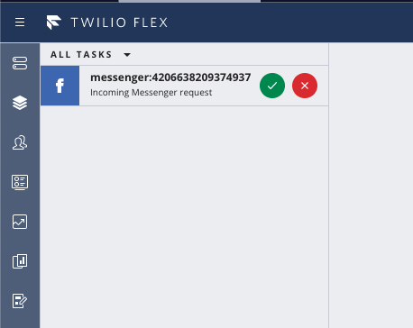
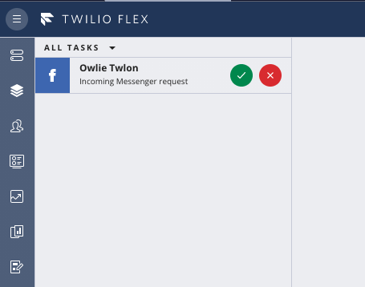
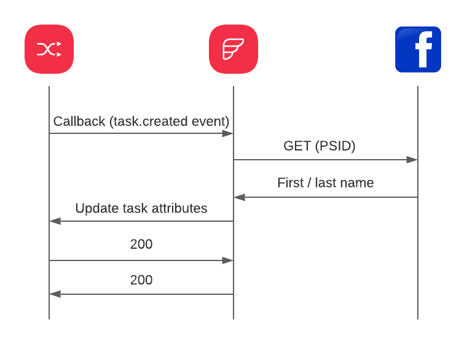

# Function for Twilio Flex to show Facebook Profile name

This Function when used in Twilio Flex enables your agents to see a Facebook profile name on incoming task instead of the PSID.

## Screenshots
This is how Flex shows a Facebook messenger task by default:



This is how it looks like with function:



## How it works?

When a new Task created in TaskRouter a callback will be fired to the lambda function. 
The function will check if the task channel is Facebook.
If it is the case a request will be made to Facebook API to get profile first and last name using PSID.
Then the function will update the task attributes to overwrite the `name` attribute with first and last name.
The original value of name will be captured in `original_name` attribute.



## Configuration

In order to make use of the function you have to make a copy `.env.example` and name it `.env`. 
The content of the newly created file should be updated with:
  - [Twilio credentials (account SID and auth token)](https://www.twilio.com/docs/iam/credentials/api#authentication)
  - [Facebook API access token](https://developers.facebook.com/docs/facebook-login/access-tokens/#apptokens)

_Note: I tested it with a Facebook App Access Token.
I had to give access for the App to manage the Facebook Page that I used to configure Messenger channel on Twilio platform.
At the time of writing the link to App configuration is: https://developers.facebook.com/apps/YOUR_APP_ID/messenger/settings/
How to add Facebook channel to Flex you can find [here](https://support.twilio.com/hc/en-us/articles/360018783533-Integrating-Facebook-Messenger-with-Twilio-Flex)._

## Project Setup

Make sure you have [Node.js](https://nodejs.org) as well as [`npm`](https://npmjs.com) installed.

Afterwards install the dependencies by running `npm install`:

```bash
cd plugin-messenger-profile-name/get-facebook-name-function

# If you use npm
npm install
```

## Development

In order to run locally:

```bash
npm run start
```

Your app will run on `http://localhost:3000`.

## Deployment

When you are ready to deploy your function, in your terminal run:

```bash
npm run deploy
```

## Contributors ✨
Contributions of any kind welcome!